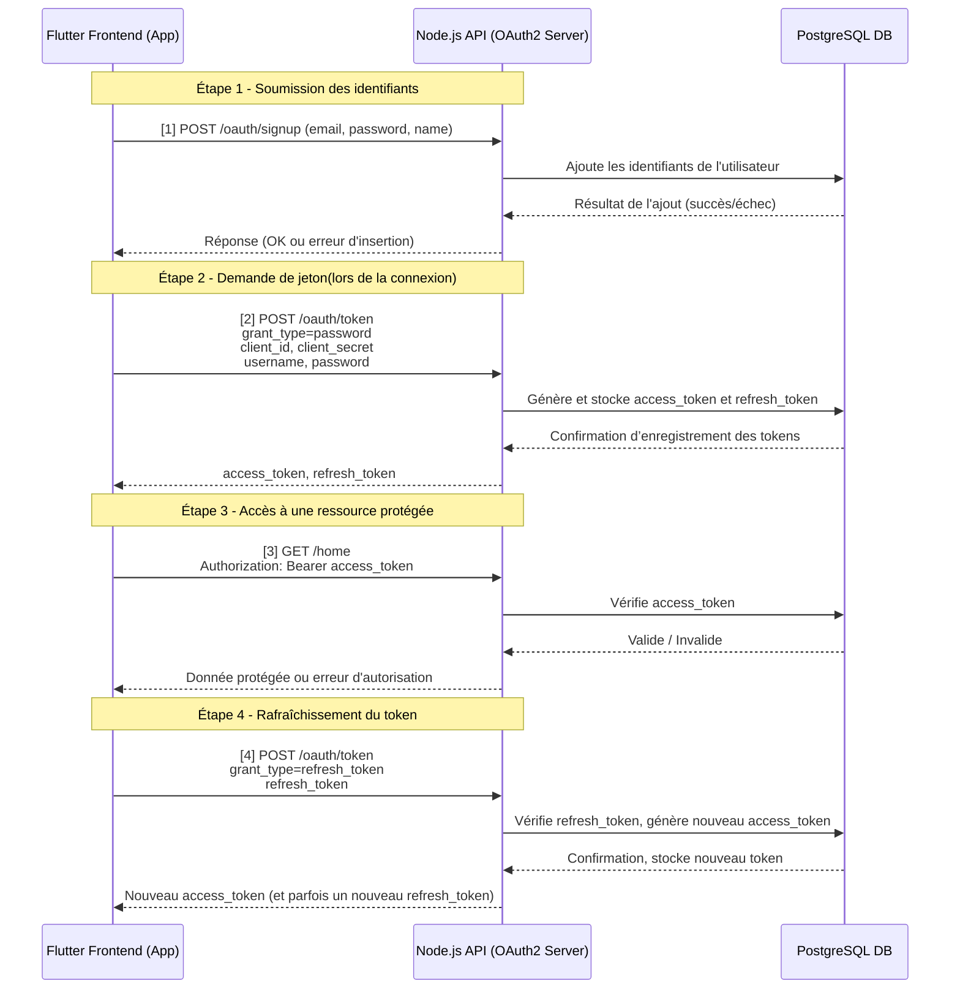

# Authentication flutter app based on oauth2

## Presentation
This is a monorepo for two part of the same project. So the repo is subdivised in two part:
- the project backend
- the project frontend

**1. The backend** is a nodejs API server that communicate with the frontend. This server has the endpoints for user authentication using oauth2.
**2. Th frontend** is a flutter app. It is a simple application with 3 page:
- login: to let user login to the account
- register: to register a new user
- home: the protected pad

## Setup
Read the read the of each part(backend & flutter app) to know how to setup the project

See the sequence diagram [here](https://www.mermaidchart.com/raw/caee0581-afc9-403f-a93b-6afd0c73f1b2?theme=light&version=v0.1&format=svg)

